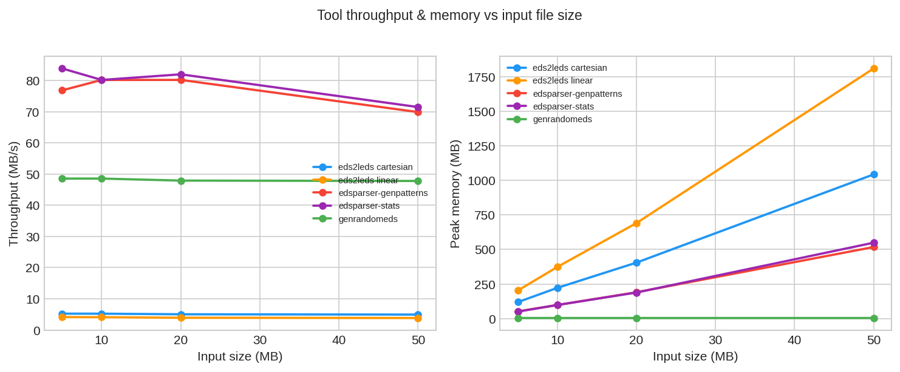
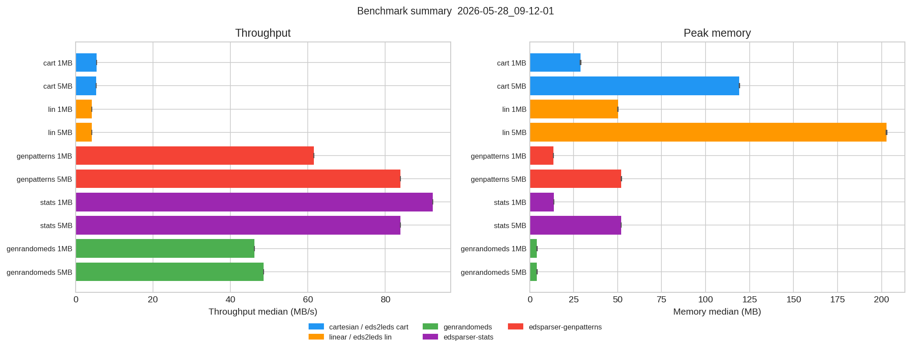
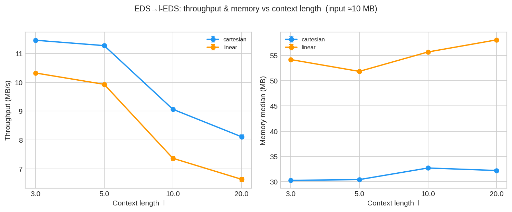
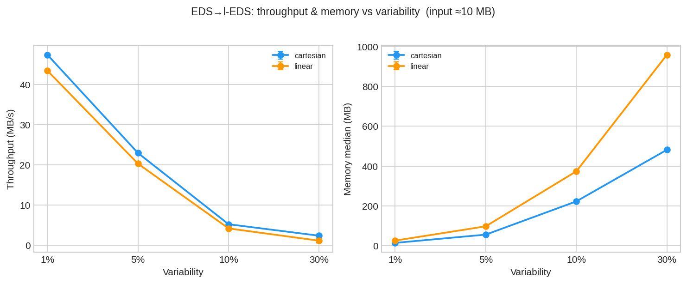
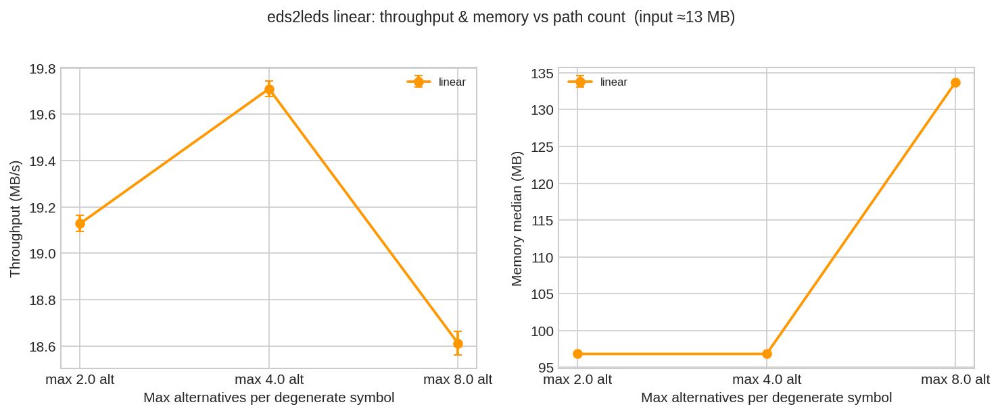

# EDSParser Benchmark Suite

Performance benchmarks for all six EDSParser CLI tools across multiple input sizes and parameter sweeps.

## Quick Start

```bash
cd tests/bench

./bench.sh --size quick      # ~5 min   (N=5  reps, sizes 1–5 MB)
./bench.sh                   # ~25 min  (N=30 reps, sizes 1–10 MB, sweep scenarios)  [default]
./bench.sh --size large      # ~90 min  (N=30 reps, sizes 5–50 MB, sweep scenarios)

./bench_compare.sh           # regression check vs baseline.csv
python3 bench_plot.py        # re-plot most recent CSV
```

## Python Dependencies (plots only)

```bash
pip install -r requirements.txt
# or inside a venv:
python3 -m venv .venv && source .venv/bin/activate
pip install -r requirements.txt
```

## Scenarios

| Scenario | Tool | What varies |
|----------|------|-------------|
| `genrandomeds_Nmb` | `genrandomeds` | Input size |
| `eds2leds_cartesian_Nmb` | `eds2leds` | Input size, no sources |
| `eds2leds_linear_Nmb` | `eds2leds` | Input size, with sources |
| `edsparser_stats_Nmb` | `edsparser-stats` | Input size |
| `edsparser_genpatterns_Nmb` | `edsparser-genpatterns` | Input size |
| `variability_V_(cartesian\|linear)` | `eds2leds` | Variant density (1 %, 5 %, 10 %) |
| `context_lL_(cartesian\|linear)` | `eds2leds` | Context length l (3, 5, 10, 20) |
| `path_count_minM_maxN_linear` | `eds2leds` | Max alternatives per degenerate symbol |

Sweep scenarios are included in `standard` and `large` presets; skipped in `quick`.

## Output

Results are written to `results/YYYY-MM-DD_HH-MM-SS.csv` with 17 columns:

```
timestamp, preset, scenario, tool, input_size_mb, n_reps,
runtime_median_s, runtime_mean_s, runtime_stddev_s, runtime_p95_s, runtime_p99_s,
memory_median_mb, memory_mean_mb, memory_stddev_mb, memory_p95_mb, memory_p99_mb,
throughput_median_mb_s
```

Plots are generated automatically into `results/plots/<timestamp>/` if `matplotlib` and `pandas` are installed.

## Benchmarking Protocol

The suite enforces seven cardinal benchmarking rules:

1. **Warmup** — one discarded run before each measurement series (warms OS page cache and branch predictor)
2. **DCE prevention** — N/A; CLI tools always write output files, so results are never dead-code-eliminated
3. **Multi-N testing** — parametrised across multiple input sizes (1, 5, 10, 50 MB) covering L1 → LLC → RAM working sets
4. **Time + memory separation** — runtime and peak RSS reported independently per run
5. **Environment hardening** — `bench.sh` warns if CPU governor ≠ `performance` or temp dir is not tmpfs-backed
6. **Statistical redundancy** — N=30 independent epochs; median, mean, stddev, P95, P99 exported for each metric
7. **I/O isolation** — all input files generated into `/tmp/` (tmpfs on Linux); warmup run pre-warms the file cache

## Updating the Reference Plots

The two committed plots below are snapshots. After a full `standard` or `large` run, update them:

```bash
# 1. Run a full benchmark
./bench.sh                  # or --size large

# 2. Copy the two main plots to docs/
LATEST=$(ls -t results/plots/ | head -1)
cp results/plots/$LATEST/size_sweep.png docs/
cp results/plots/$LATEST/summary.png   docs/

# 3. Commit
git add docs/
git commit -m "bench: update reference plots ($(date +%Y-%m-%d))"
```

---

## Reference Plots

> Last updated: 2026-05-28 · preset: `quick` · N=5 reps · sizes 1–5 MB
> Run `./bench.sh` (standard preset, N=30) and follow the update instructions above for production-quality graphs.

### Throughput & memory vs input size



### Summary — all scenarios



### Context length sweep (l = 3, 5, 10, 20)



### Variability sweep (variant density 1 %, 5 %, 10 %)



### Path count sweep (max alternatives per degenerate symbol)


